# Safe Home Exploration
Repository for safe home exploration project

# Architecture
- We are loading every day data in incremental way into this system by using simple medallion architecture
  
  - ### bronze.py 
    - This will give call to Dune query and fetch latest result. (In dune query, every midnight will update result set for last date)
    - will save result into csv format at layer bronze (path - `bronze/eth_transfers_data/block_date={block_date_value}/`)
  
  - ### silver.py
    - This script will use spark to process data from bronze layer for given block date and append it to existing silver layer
    - Storage path - `/silver/eth_transfers_data_quarantined/year=*/month=*/`
    - Format - DELTA

  - ### gold.py
    - Processing silver data by aggregation and move to existing gold layer as per Month and Year of block date
    - This script will use spark to process data from silver layer for given month and year.
    - Post aggregation, we can model final layer using DW modelling methods like Star, Snowflake etc.
      - vertical data - `/gold/eth_transfers_data_aggregated_vertical/year=*/month=*/`
      - protocol data - `/gold/eth_transfers_data_aggregated_protocol/year=*/month=*/`
    - Format - DELTA

  - ### topk_analysis.py
    - Finally, here we are just executing queries to analyse gold layer data to get objective 
      - A. Taking the output of Task 3, identify the Top 5 TVP verticals based on:
        - - e.g. sample output based on sample data -
          - i. Highest transaction volume. 
          - ii. Highest transaction count.
            - 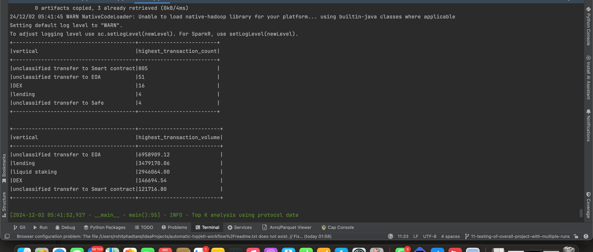
      
      - B. Taking the output of Task 3, identify the Top 5 TVP protocols based on:
        - i. Highest transaction volume.
        - ii. Highest transaction count.
        - 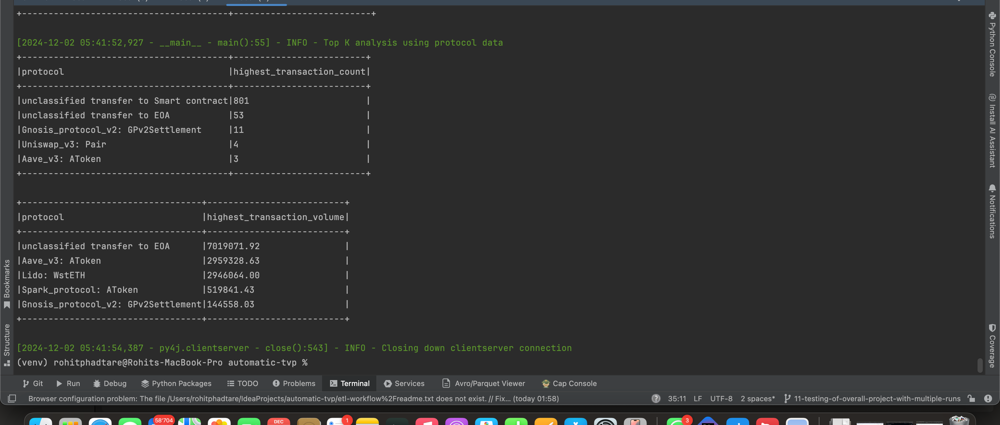

---

## Limitations
- As Dune analytics is based on credit, I've downloaded sample data sets already for exploration of this project.
- Future scope for this project, need to consider following changes 
  - Need CI/CD pipeline before packaging docker solution to test latest changes with the help of cucumber framework
    - As of now, automated tests are executing well with help of manual commands
    - 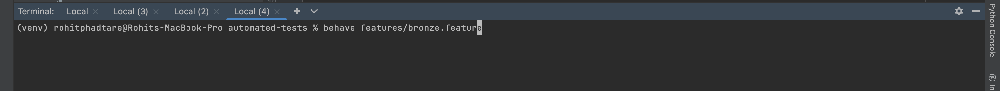
    - 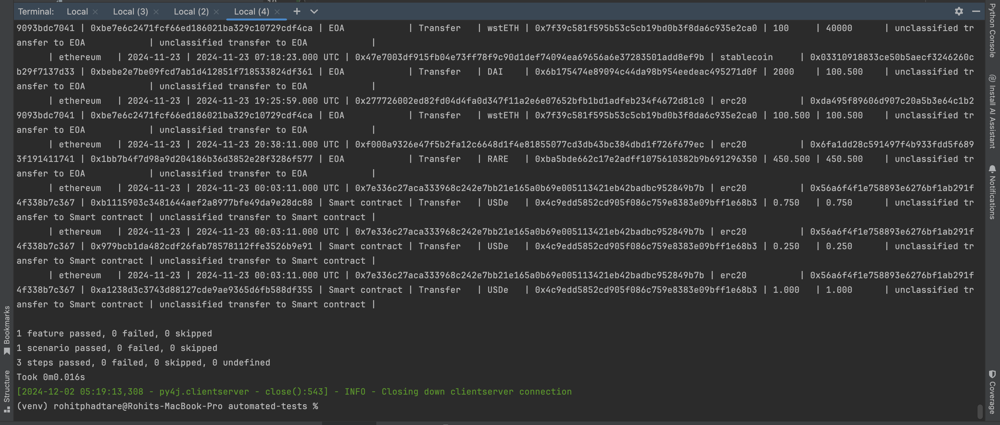
  - Fully automated ETL with orchestration tool Airflow and spark cluster with Yarn.
    - Currently, we can execute ETL jobs using SparkSubmitOperator of Airflow. However, those are available only in client mode.
      Hence, need to find more suitable way to leverage spark cluster with cluster mode. (Like SSHOperator)

## Assumptions
- Assuming Dune query is getting refresh daily between 00:00 - 01:00 AM
- Once Dune query is refreshed, our ETL pipeline will get execute and populate latest results in final layer.

---
# Set Up cluster and orchestration services 
- For our project we need spark and airflow cluster which can be useful to run spark workloads along with orchestration.
- Here, we will see how set up our spark cluster along with Airflow with help of docker containers on local machine. 
  PFB docker commands to spin up airflow and spark cluster

- ## For spinning up container services locally - `docker-compose up -d`
  - 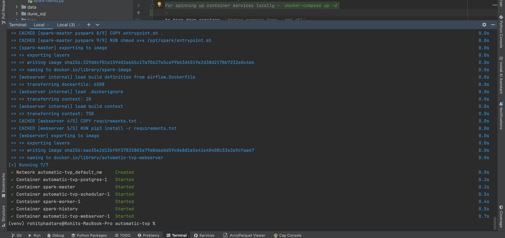
  - Check on docker demon all containers are up and running
    - 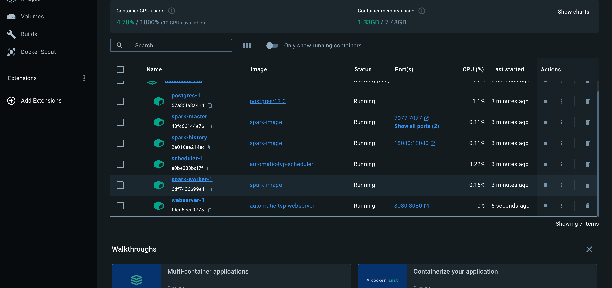
    - Here you will get overview of container services which are up and running
  - ### To check airflow is running 
    - Visit home web url: http://localhost:8080/login/
    - Use both username and password as 'admin' to login.
    - If you can visit home url and able to log in it means airflow services are running fine
      - 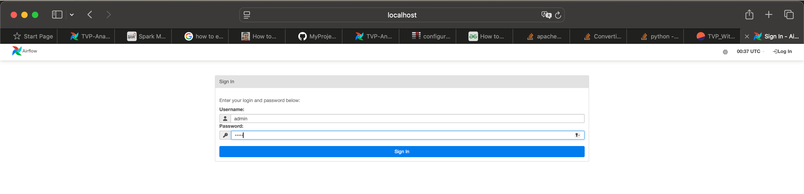
    - Upon successful login you will land into following page
      - 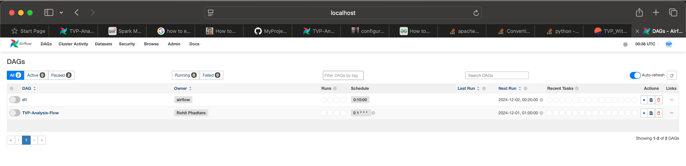
   
  - ### To check if spark cluster is up and running
    - To check spark master node is up and running. here we can view applications which are completed or in running state 
      - URL: http://localhost:8081
      - 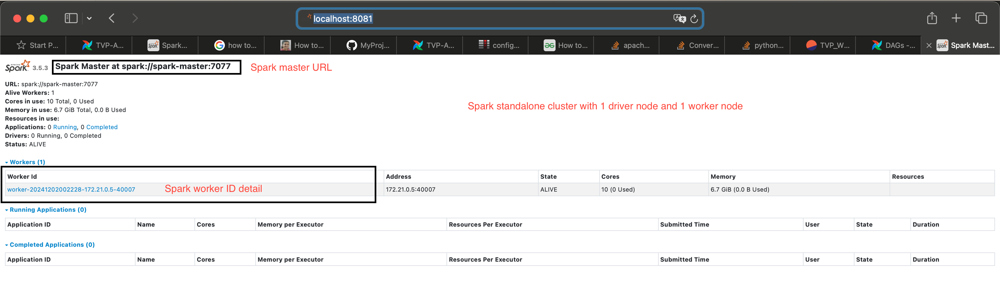

    - To check if spark history server is up and running
      - URL: http://localhost:18080
      - 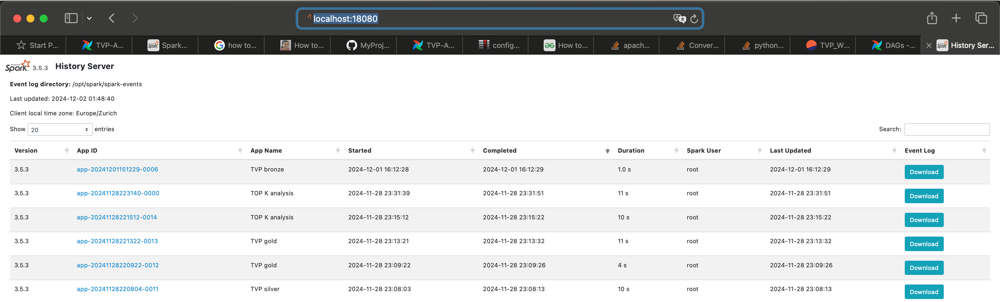

- ## Login to particular container service
    - For example, let's log in to spark-master node using docker exec command as below
      `docker exec -it spark-master bash`
    - 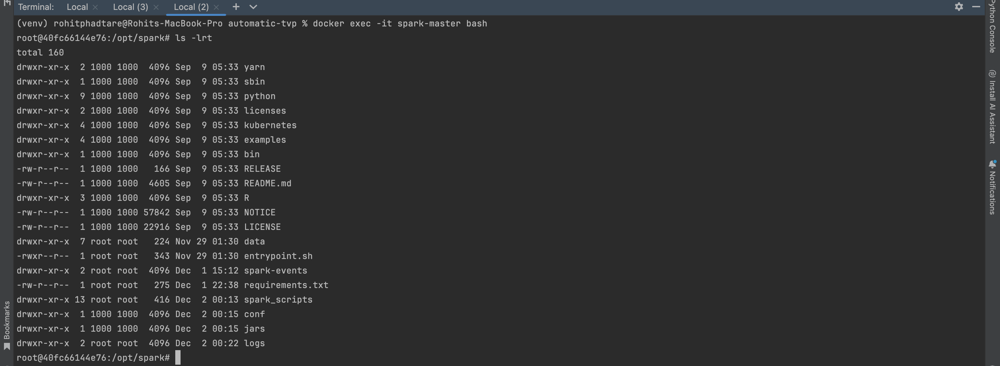

- ## To tear down spark and airflow cluster - `docker compose down --rmi all`
  - When we want to destroy spark and airflow cluster post our exploration, then will use this command.
  - Above command will take down the spark cluster along with airflow services.
    Basically, It will remove containers from docker engine.
  - 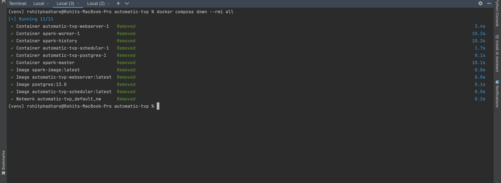

---

### How to execute jobs - manually
- Step 1: `docker exec -it spark-master bash`
- Step 2: `python spark_scripts/bronze.py 2024-11-23`
- Step 3: `python spark_scripts/silver.py 2024-11-23`
- Step 4: `python spark_scripts/gold.py 2024-11-23`
- Step 4: ``python spark_scripts/topk_analysis.py 2024-11-23``

- ### ETL orchestration way for executing above commands automatically.
  - Once we log in to Airflow home web url, need to create below connection 
    which our dag with id - 'TVP-Analysis-Flow' needed to execute tasks within it
  - First un-paused the dag
    - 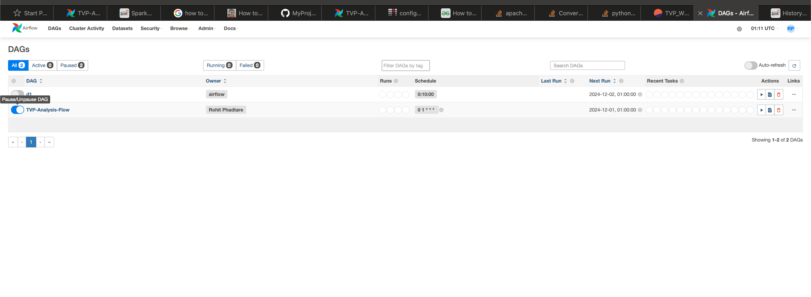
  - Go to Admin -> Connections -> add new connection
    - This is required to submit spark job from airflow service to master node using SparkSubmitOperator in DAG
    - 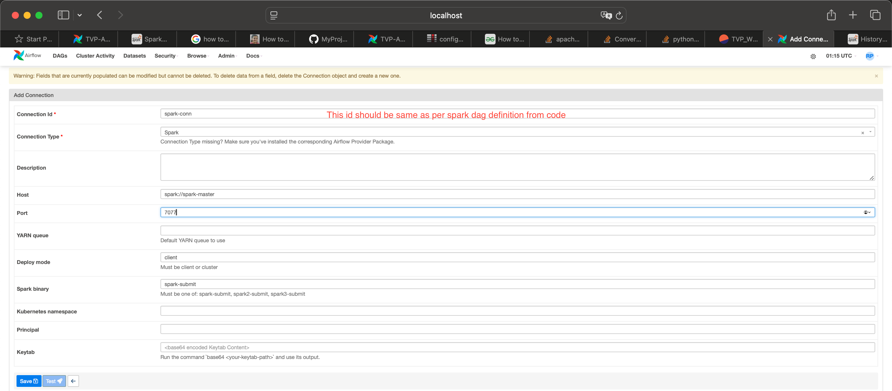
  - Post above step, for testing purpose triggering DAG manually.
   (Remember in production this will be done automatically on every midnight 1 AM as per cron definition)
  - 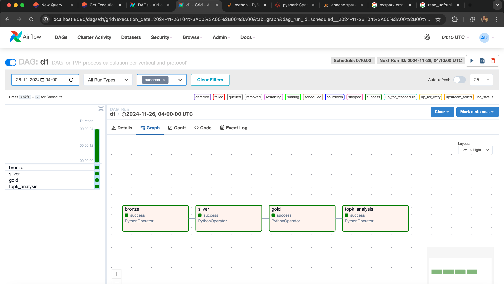
